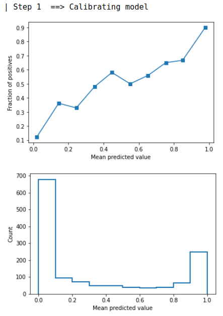
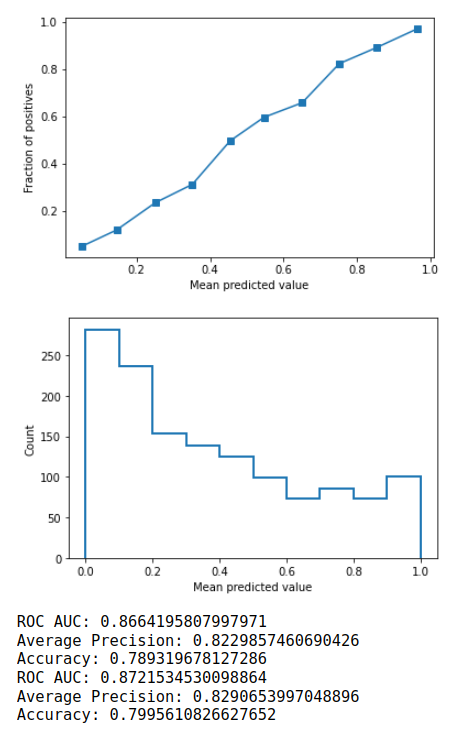
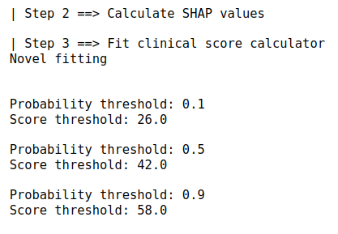

Uni-ACS (Unified Automatic Clinical Scoring) is a model agnostic approach to automatically generating clinical scores from SHAP compatibale clinical Machine Learning (ML) models. As Uni-ACS uses the original ML model and its explanations as a base for clinical score construction, it retains global and local interpretations of the original model, while promising to retain a significant proportion of the original ML model's predictive performance.

## Background

Modern interpretable ML tools (e.g. LIME, SHAP and explainable boosting machines) have made significant progress in explaining "black box" ML models. However, these tools' outputs continue to be unfamiliar to most clinicians. Clinicians' preferred tool of patient risk stratification remains to be clinical scores. Plausible reasons for such a preference as follows:
- Clinical scores are concise, thus they are easy to remember.
- Clinical scores can be easily correlated to the clinical context.
- Clinical scores can be calculated at bedside without the assistance of a machine.
Therefore, Uni-ACS aims to overcome this clinical translation problem by translating ML models into clinical scores.

## Requirements

- SHAP
- PyGAM
- CSAPS
- Scikit-Learn
- Pandas
- Numpy

## Quick Guide

### Start by importing Uni-ACS.
```
import medical_explainer
```

### Set up data and train the ML model
Set up the dataset by splitting up into train and test set. Train your favourite ML model as `clf` on the train set. Calculate the performance metrics of the ML model on the test set. Run the following code to initialise the Uni-ACS medical explainer:

```
explainer = medical_explainer.explainer(
    clf, X_train, y_train, X_test, y_test)
```

Run the automatic algorithm to translate ML model `clf` into the clinical score as shown in below code snippet. 
- First parameter refers to the number of top model features to include into the clinical score. 
- Second parameter refers to the SHAP method of calculation. Possible options include `tree` for ensemble decision tree models, `linear` for linear models and `kernel` for neural network models and other SHAP compatible models. 
- Third parameter refers to the method of categorising the features. Possible options include `novel` for calculating categories based on feature partical dependence distribution, `qunatile` for determining categories based on centiles of feature value distributiuon and `GAM` for determining categories based on Generalised Additive Model (GAM) fit.

```
explainer.fit(10, shap_method='tree', method='novel')
```

It will run through the steps as detailed in the algorithm proposed by the Uni-ACS paper. Output of the method as shown below:







### Citations

Work In Progress at the moment. Paper yet to be published.
